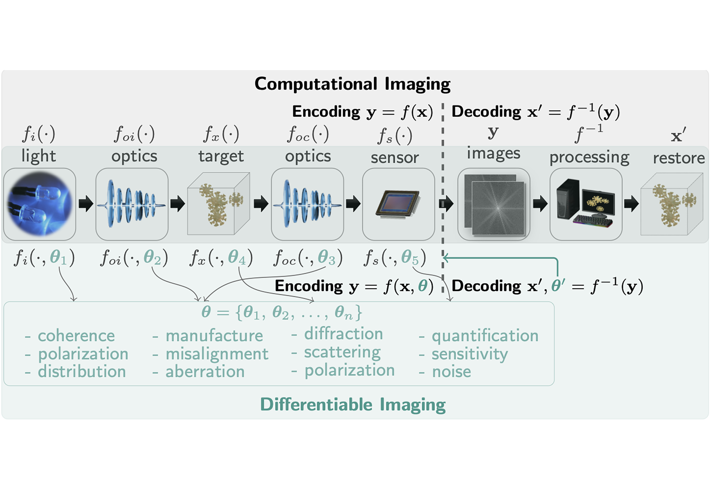

<!-- ## Differentiable Imaging: a new tool for computational optical imaging {.unnumbered} -->

Advanced Physics Research, 2023

<a href="https://ni-chen.github.io/" class="author">Ni Chen</a>1, <a href="http://www.holoddd.com/" class="author">Liangcai Cao</a>2, <a href="https://sites.google.com/vt.edu/oshandholographiclab/" class="author">T.-C. Poon</a>3, <a href="http://oeqelab.snu.ac.kr/PROF" class="author">Byoungho Lee</a>4, <a href="https://www.eee.hku.hk/~elam/" class="author">Edmund Y. Lam</a>5

 

Computational imaging has made significant advancements in recent years, but faces limitations due to the restrictions imposed by traditional computational techniques. Differentiable programming offers a promising solution by combining the strengths of classical optimization and deep learning. By integrating physics into the modeling process, **differentiable imaging** [@Chen2023APR] - which employs differentiable programming in computational imaging - has the potential to overcome challenges posed by sparse, incomplete, and noisy data. This could be a key factor in advancing the field of computational imaging and its various applications.

Modeling the physics accurately is of great importance in differentiable imaging. Since many computational imaging techniques rely on ray tracing and diffraction [@Chen2022OE], we have developed both a **ray-tracing differentiable framework** [@Wang2022TCI] and a **diffraction-based differentiable framework** [@Chen2023LPOR]. These frameworks have applications in self-calibration, end-to-end lens design [@Wang2022TCI], metrology [@Wang2021OE], holography ($\partial {H}$) [@Chen2023LPOR,@Wu2023DH], Phase Retrieval [@JWang2024MP, @Wang2024COSI, @Wang2024COSI], Fourier Ptychographic Microscopy [@Wang2024COSI, @Chen2024ODF, @Chen2024FiO] and more. The differentiable ray-tracing framework has proven to be highly efficient and enables easy incorporation of neural networks, thereby promoting lens design.

Please refer to the paper to find how this **differentiable imaging** [@Chen2023APR] enables more efficient and effective imaging, and our insights on its potential impact in the computational imaging field.

## References {.unnumbered}
